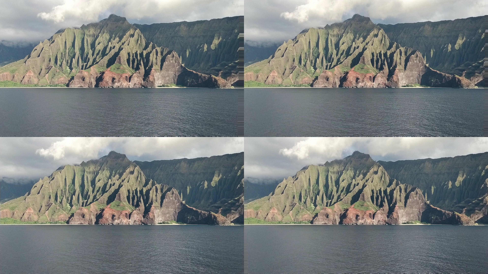

# LeiaQuilt
Utility for aligning images into a 2x1 or 2x2

## Installation
```sh
pip3 install git+https://github.com/LeiaInc/LeiaQuilt
```

## Usage

```sh
# Create a 2x1 image
leiaquilt example_input/view_0.jpg example_input/view_1.jpg
```


```sh
# Create a 2x2 image
leiaquilt example_input/view_0.jpg example_input/view_1.jpg example_input/view_2.jpg example_input/view_3.jpg
```



## Advanced

Views captured by real cameras may not be well aligned.

As an example, this content was captured off of a moving ship.
You can observe horizontal motion, as well as a small amount of vertical motion.


In order to get a high-quality Lightfield image, it's important to correct for this.
By default, `leiaquilt` uses feature-matching to align the images:


